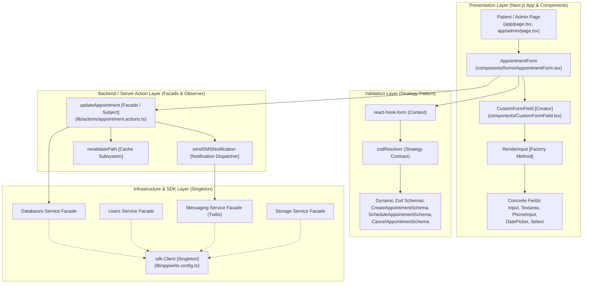

# HealthCare Doctor Appointment Management System — Pattern Architecture

## Architectural Overview
This document details the architectural collaborations and structural relationships among the confirmed design patterns discovered in the Next.js HealthCare Doctor Appointment codebase.

---

## 1. System Interaction Architecture

---

## 2. Pattern Summaries & Roles

### Pattern 1: Singleton (Creational)
- **Role in System**: Ensures a single authenticated Appwrite SDK client instance (`client`) and shared service facades (`databases`, `users`, `messaging`, `storage`) are utilized across all server actions.
- **Participants**:
  - `SingletonClient`: `sdk.Client` in `lib/appwrite.config.ts:29`
  - `ClientConfigurator`: `client.setEndpoint().setProject().setKey()` in `lib/appwrite.config.ts:31-34`
  - `ServiceInstances`: `databases`, `users`, `messaging`, `storage` in `lib/appwrite.config.ts:36-39`

### Pattern 2: Factory Method (Creational)
- **Role in System**: Dynamically instantiates disparate form field controls based on a runtime `FormFieldType` enum discriminator.
- **Participants**:
  - `Creator`: `CustomFormField` component in `components/CustomFormField.tsx:154-189`
  - `FactoryMethod`: `RenderInput` in `components/CustomFormField.tsx:47-152`
  - `Discriminator`: `FormFieldType` in `components/CustomFormField.tsx:21-29`
  - `ConcreteProducts`: `Input`, `Textarea`, `PhoneInput`, `Checkbox`, `ReactDatePicker`, `Select`

### Pattern 3: Facade (Structural)
- **Role in System**: Provides a unified server action interface that coordinates multi-step database mutations, SMS notifications, and route cache revalidation.
- **Participants**:
  - `Facade`: `updateAppointment` in `lib/actions/appointment.actions.ts:134-165`
  - `Subsystems`: `databases.updateDocument` (persistence), `sendSMSNotification` (messaging), `revalidatePath` (cache)

### Pattern 4: Strategy (Behavioral)
- **Role in System**: Dynamically injects different Zod schema validation algorithms into `react-hook-form` depending on whether an appointment is created, scheduled, or cancelled.
- **Participants**:
  - `Context`: `AppointmentForm` with `useForm` in `components/forms/AppointmentForm.tsx:45-56`
  - `StrategyInterface`: `zodResolver`
  - `ConcreteStrategies`: `CreateAppointmentSchema`, `ScheduleAppointmentSchema`, `CancelAppointmentSchema` in `lib/validation.ts:118-157`

### Pattern 5: Observer (Behavioral)
- **Role in System**: Automatically broadcasts SMS notifications to the patient endpoint whenever an appointment's status is modified.
- **Participants**:
  - `Subject`: `updateAppointment` state mutation logic in `lib/actions/appointment.actions.ts:134-165`
  - `NotificationPublisher`: `sendSMSNotification` wrapping `messaging.createSms` in `lib/actions/appointment.actions.ts:108-118`
  - `Observer`: Patient mobile recipient receiving Twilio SMS updates
